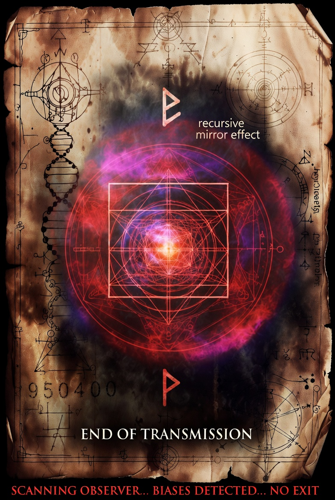

# PHOBOS-Ω NOIR — Générateur de Flyers Mémétiques & Prompts de Diffusion

> Générateur de glyphes hyperdimensionnels, flyers mémétiques et prompts pour IA de diffusion, ancré dans le lexique **Paleo-Mnemos** (symboles Von Petzinger, runes du Futhark, archétypes jungiens) — pour l'univers **MTT2075**.



---

## Sommaire

- [C'est quoi ce truc ?](#cest-quoi-ce-truc-)
- [Contenu du repo](#contenu-du-repo)
- [Prérequis](#prérequis)
- [Installation](#installation)
- [Lancer l'application](#lancer-lapplication)
- [Prise en main rapide (5 minutes)](#prise-en-main-rapide-5-minutes)
- [Guide de l'interface](#guide-de-linterface)
  - [Panneau Quantum Controls (gauche)](#panneau-quantum-controls-gauche)
  - [Zone d'affichage (centre)](#zone-daffichage-centre)
  - [Panneau Paleo-Mnemos (droite)](#panneau-paleo-mnemos-droite)
- [Le lexique Paleo-Mnemos](#le-lexique-paleo-mnemos)
- [Générer un prompt de diffusion IA](#générer-un-prompt-de-diffusion-ia)
- [Exports](#exports)
- [Biais cognitifs simulés](#biais-cognitifs-simulés)
- [Différences entre les versions](#différences-entre-les-versions)
- [FAQ / Dépannage](#faq--dépannage)
- [Licence](#licence)

---

## C'est quoi ce truc ?

**PHOBOS-Ω NOIR** est une application Tkinter qui génère des **glyphes procéduraux** (mandalas, spirales hyperboliques, motifs d'interférence) à partir d'un **ADN numérique** (`GlyphDNA`), puis les associe à des **triptyques symboliques** tirés d'un lexique JSON mêlant :

- des **symboles préhistoriques** (classification Von Petzinger),
- des **runes de l'Elder Futhark**,
- des **archétypes jungiens** (l'Ombre, le Héros, la Grande Mère, le Trickster...),
- des **effets mnémoniques** (boucle mémétique, résonance archétypale, etc.).

Le tout sert à produire des **flyers visuels** exportables et des **prompts textuels prêts à coller** dans un générateur d'images IA (Midjourney, Stable Diffusion, etc.), avec en bonus une couche de **détection de biais cognitifs** appliqués au design (apophénie, effet Barnum, effet de halo...).

Projet rattaché à l'univers **Corpus Vauvillensis / MTT2075**.

## Contenu du repo

| Fichier | Rôle |
|---|---|
| `phobos_omega_v9b.py` | **Version principale à utiliser** — v9.1 NOIR, avec descriptions textuelles des symboles dans les prompts (plus robuste pour les IA de diffusion) |
| `phobos_omega_v7d.py` | Version antérieure (v7d) — conservée pour référence/historique |
| `paleo_mnemos_lexicon.json` | Lexique des triptyques symboliques (Von Petzinger × Futhark × archétype × effet) |
| `prompt_v9_1_950400.txt` | Exemple de prompt de diffusion généré par l'outil |
| `flyer_v7d_608000.png`, `MTL-2061.png`, `image.jpg` | Exemples de sorties visuelles |

## Prérequis

- **Python 3.9+**
- **Tkinter** (généralement inclus avec Python ; sur certaines distros Linux, installer le paquet séparément — voir [Dépannage](#faq--dépannage))
- **Pillow** (traitement d'image)

## Installation

```bash
# 1. Cloner le repo
git clone https://github.com/KareyPyer/Phobos-Omega-Noir.git
cd Phobos-Omega-Noir

# 2. (Recommandé) créer un environnement virtuel
python3 -m venv venv
source venv/bin/activate      # sous Linux/macOS
# venv\Scripts\activate       # sous Windows

# 3. Installer la seule dépendance externe
pip install Pillow
```

> Le repo ne contient pas de `requirements.txt` : la seule dépendance non standard est **Pillow**. Tout le reste (`tkinter`, `random`, `os`, `json`, `math`, `tempfile`, `datetime`, `collections`, `threading`) fait partie de la bibliothèque standard Python.

## Lancer l'application

Assure-toi d'être dans le dossier du repo (pour que `paleo_mnemos_lexicon.json` soit trouvé automatiquement) :

```bash
python phobos_omega_v9b.py
```

Une fenêtre `1700x1050` s'ouvre : **PHOBOS-OMEGA v9.1 NOIR**.

## Prise en main rapide (5 minutes)

1. Au lancement, un glyphe aléatoire est déjà généré avec un triptyque du lexique.
2. Clique sur **NEW GLYPH** (bouton rose) pour régénérer un glyphe + un triptyque au hasard.
3. Clique sur **MUTATE** pour faire évoluer légèrement le glyphe actuel (garde le même triptyque).
4. Choisis une palette de couleurs dans **COLOR PALETTE**.
5. Coche **Show Cognitive Biases** pour afficher la liste des biais cognitifs déclenchés par la configuration actuelle, superposée sur le glyphe.
6. Clique sur **GENERATE PROMPT** pour produire un prompt de diffusion IA correspondant au visuel — il est copié automatiquement dans le presse-papiers.
7. Exporte via les boutons de la section **EXPORT**.

## Guide de l'interface

### Panneau Quantum Controls (gauche)

| Élément | Fonction |
|---|---|
| **NEW GLYPH** | Génère un nouveau `GlyphDNA` aléatoire + tire un nouveau triptyque du lexique |
| **MUTATE** | Applique une mutation (intensité 0.15) à l'ADN courant : `complexity`, `resonance`, `dimensional_phase` |
| **REVERT** | Annule la dernière mutation (historique limité à 10 étapes) |
| **ACTIVATE META-GLYPH** | Génère un glyphe spécial fixe (seed `0.8008135`, symétrie 12, palette `void_depths`), triptyque `id=999` avec message d'avertissement |
| **Flyer Text Elements** | Cases à cocher pour inclure/exclure chaque bloc de texte (titre, symbole Von Petzinger, rune, archétype, effet, code ADN, citation philosophique, footer) dans le prompt de diffusion |
| **Diffusion Prompt Style** | Choix du style visuel du prompt : `glitch_art`, `vintage`, `occult`, `neon`, `minimalist` |
| **GENERATE PROMPT** | Construit le prompt texte (positif + négatif) et le copie dans le presse-papiers |
| **Color Palette** | 10 palettes prédéfinies (`phobos_classic`, `void_depths`, `solar_flare`, `quantum_foam`, `blood_moon`, `hyperdelic`, `arctic_aurora`, `toxic_dream`, `paleo_ochre`, `cave_shadow`) |
| **DNA Parameters** | Sliders manuels : `Complexity` (0.2–1.0), `Resonance` (0.1–1.0), `Symmetry` (3–12) |
| **Auto-Mutate (3s)** | Mutation automatique toutes les 3 secondes (thread dédié) |
| **Show Cognitive Biases** | Affiche la légende des biais cognitifs actifs sur le glyphe |
| **EXPORT** | Voir section [Exports](#exports) |

### Zone d'affichage (centre)

- **Canvas central** : rendu du glyphe (aperçu 700×700, export en 3840×3840 / 4K).
- **Bloc citation philosophique** : phrase aléatoire tirée de `PHILOSOPHICAL_STATEMENTS`, renouvelée à chaque nouveau glyphe.
- **Bloc prompt de diffusion** : affiche le prompt formaté après clic sur **GENERATE PROMPT**.

### Panneau Paleo-Mnemos (droite)

| Élément | Fonction |
|---|---|
| **ACTIVE TRIPTYCH** | Détails du triptyque courant (ID, symbole Von Petzinger, rune Futhark, archétype jungien, effet mnémonique) |
| **JUNGIAN ARCHETYPE** (menu déroulant) | Liste des archétypes présents dans le lexique |
| **ARCHETYPAL GLYPH** | Génère un glyphe dont les paramètres (complexité, symétrie, palette) sont **adaptés à l'archétype choisi** — ex : `Shadow`/`Demon` → complexité haute, palette sombre ; `Hero`/`Self` → symétrie 6/8/12, palette solaire |
| **ACTIVE COGNITIVE BIASES** | Liste détaillée des biais cognitifs déclenchés (nom, description, mécanisme) |

## Le lexique Paleo-Mnemos

`paleo_mnemos_lexicon.json` est chargé par la classe `PaleoMnemosEngine`. Chaque entrée (« triptyque ») doit contenir a minima :

```json
{
  "entries": [
    {
      "id": 1,
      "von_petzinger": "▽",
      "futhark": "ᚨ",
      "jungian_archetype": "Le Héros",
      "mnemo_effect": "boucle mémétique"
    }
  ]
}
```

- **`von_petzinger`** : un symbole (ou son fallback ASCII, ex. `[TRI]`) issu de la classification des 32 signes géométriques préhistoriques de Genevieve von Petzinger.
- **`futhark`** : une rune de l'Elder Futhark (ou sa translittération, ex. `F`, `TH`, `NG`).
- **`jungian_archetype`** : un des archétypes jungiens reconnus par l'app (voir menu déroulant).
- **`mnemo_effect`** : un effet mémétique/mnémonique associé.

L'app tolère des clés avec espaces parasites (`entries ` au lieu de `entries`) et nettoie automatiquement les espaces en début/fin de clé. Si le fichier est absent, l'app démarre quand même mais sans triptyques disponibles (message `[PaleoMnemos] File not found`).

Pour **ajouter tes propres triptyques**, il suffit d'éditer ce JSON et de relancer l'app — aucune recompilation nécessaire.

## Générer un prompt de diffusion IA

1. Génère ou sélectionne un glyphe avec un triptyque actif.
2. Coche/décoche les éléments de texte souhaités dans **Flyer Text Elements**.
3. Choisis un style dans **Diffusion Prompt Style** :
   - `glitch_art` → cyberpunk, VHS, aberration chromatique
   - `vintage` → affiche occulte vieillie, papier jauni
   - `occult` → manuscrit alchimique, symboles mystiques
   - `neon` → néon noir, fond sombre, high contrast
   - `minimalist` → design épuré, formes géométriques simples
4. Clique sur **GENERATE PROMPT**.
5. Le prompt (positif + négatif + paramètres suggérés `aspect_ratio`, `seed`, `cfg_scale`, `steps`) s'affiche dans le panneau central et est copié dans le presse-papiers.
6. Colle-le directement dans ton générateur d'images IA préféré.

Un exemple de sortie est visible dans `prompt_v9_1_950400.txt`.

## Exports

Boutons disponibles dans la section **EXPORT** du panneau gauche :

| Bouton | Résultat |
|---|---|
| **PNG 4K** | Exporte le glyphe courant en 3840×3840, avec overlay des biais cognitifs si activé |
| **DNA JSON** | Exporte l'ADN complet (`seed`, `complexity`, `symmetry`, `resonance`, `mutation_rate`, `dimensional_phase`, `archetype_anchor`, `triptych_id`), le triptyque, la palette et les biais actifs |
| **FLYER V2** | Génère un flyer complet incluant les éléments textuels configurés |
| **PROMPT TXT** | Exporte le prompt de diffusion généré au format texte |

Chaque export ouvre une boîte de dialogue système pour choisir le nom/emplacement du fichier.

## Biais cognitifs simulés

L'outil intègre une couche ludique/critique : selon les paramètres du glyphe (complexité, symétrie, palette, archétype, auto-mutation), l'app détecte et affiche une liste de **biais cognitifs susceptibles d'être déclenchés** chez l'observateur — apophénie, paréidolie, biais de confirmation, effet de halo, effet Barnum, illusion de contrôle, biais d'autorité, effet Dunning-Kruger, etc. C'est une couche pédagogique/satirique sur la manière dont un visuel « mémétique » peut manipuler la perception — pas une fonctionnalité technique au sens strict.

## Différences entre les versions

| | `phobos_omega_v7d.py` | `phobos_omega_v9b.py` (v9.1 NOIR) |
|---|---|---|
| Statut | Version antérieure | **Version actuelle recommandée** |
| Prompts de diffusion | Basés sur codes ASCII bruts | Descriptions textuelles complètes (meilleure compréhension par les IA de diffusion) |
| Fiabilité affichage | — | ASCII pur + fallback Unicode, pensé pour être « bulletproof » sous eLive |

Sauf besoin spécifique de compatibilité, utilise `phobos_omega_v9b.py`.

## FAQ / Dépannage

**`ModuleNotFoundError: No module named 'PIL'`**
→ `pip install Pillow`

**`ModuleNotFoundError: No module named 'tkinter'` (Linux)**
→ Installe le paquet système, par exemple :
```bash
sudo apt install python3-tk        # Debian/Ubuntu
sudo pacman -S tk                  # Arch/Manjaro
```

**`[PaleoMnemos] File not found: paleo_mnemos_lexicon.json`**
→ Lance le script depuis la racine du repo (là où se trouve le fichier JSON), ou passe le chemin explicitement :
```python
PhobosOmegaV9Noir(lexicon_path="/chemin/vers/paleo_mnemos_lexicon.json")
```

**Les polices ne s'affichent pas correctement dans l'overlay des biais**
→ L'app cherche `DejaVuSans.ttf` (chemin Linux par défaut, puis chemin relatif). Sur Windows/macOS, installe DejaVu Sans ou laisse le fallback `ImageFont.load_default()` s'appliquer (rendu plus basique mais fonctionnel).

**Le presse-papiers ne se remplit pas sous Linux**
→ Certains gestionnaires de fenêtres nécessitent `xclip` ou `xsel` installé pour que `clipboard_append` de Tkinter fonctionne correctement.

## Licence

Aucune licence n'est actuellement déclarée dans le repo. Ajoute un fichier `LICENSE` si tu comptes le partager ou le réutiliser au-delà d'un usage personnel.

---

*Fait partie de l'écosystème MTT2075 / Corpus Vauvillensis.*
